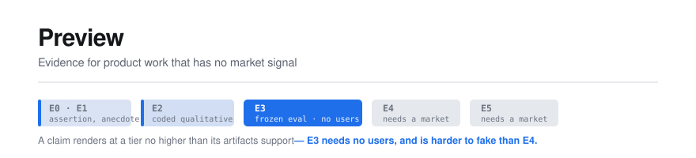

<p align="center">
  
</p>

<p align="center">
  <a href="https://github.com/ajinkyabhanudas/preview/actions/workflows/ci.yml"></a>
  
  
  
  
</p>

<p align="center">
  <strong>A standard for evidencing product work that has no market signal, and a
  renderer that turns a repository following it into a site a reviewer can read.</strong>
</p>

---

## The problem

Someone finishes a degree, wants to move into product, and is told to build a
portfolio. So they build something. The work sits in a repository that the people
evaluating them will not open and could not read. The only signals they know how
to claim — users, revenue, growth — require a market they do not have. So they
describe features, which reads as a list of things they made rather than evidence
that they can think.

They conclude the project failed, do not publish it, and several hundred hours
produce nothing they can point at. Then they start the next one with less energy
than the last.

There is a settled way to evidence engineering work: the repository, the commits,
the tests. There is a settled way to evidence business work: the deck and the
numbers. **Nobody has settled how you evidence product judgment on work that has
no market yet.**

That gap is widest exactly where hiring demand is highest. AI product roles turn
on defining what good means, building evals, and reading a failure distribution.
None of those require a single user to demonstrate.

## The idea

Every claim in a portfolio carries an evidence tier, E0 to E5, and **a claim
renders at a tier no higher than the artifacts in the repository can support.**

| Tier | Rests on | Needs users? |
|---|---|---|
| E0 | An assertion | No |
| E1 | One anecdote | No |
| E2 | Coded qualitative work with `n` stated | People to talk to |
| E3 | Offline evaluation against a frozen, hash-pinned set | **No** |
| E4 | Before/after on instrumented usage | Yes |
| E5 | Controlled comparison with named arms | Yes, at volume |

The product sits in one observation about that table. **E3 is fully reachable
with zero users, and it is both rarer and harder to fake than E4.** Someone with
a rigorous eval suite is more credible than someone with a dashboard of unaudited
usage numbers. The standard's job is making that legible to reviewers who do not
yet know to ask for it.

A second principle does the rest of the work: **a well-measured failure counts as
a good outcome.** Someone who defined success, measured honestly, found it did
not work, and said so has demonstrated more than someone who shipped without
knowing whether it helped. That is also the strongest anti-fabrication mechanism
available — once failure is publishable, most of the reason to invent success
disappears.

## Status

**The renderer builds a site. The standard has not been reviewed by anyone but
its author, and no real portfolio has been built with it.**

Those two sentences are the honest summary, and the second matters more than the
first.

| Component | State |
|---|---|
| The standard (`spec/standard-v0.1.md`) | Draft v0.1 — **read by its author and nobody else** |
| Build specification (`spec/build-v1.md`) | Draft |
| Pipeline: ingest → filter → validate → resolve → render → emit | Built, 130 tests |
| Authoring (`preview init`) | Built — extracts drafts from existing evidence |
| CI gates | Five, all active |
| A real portfolio built to the standard | **None, including the author's own** |
| Practitioner review | Not started |
| Comprehension test (H-5) | Not run |

A working renderer is not evidence that the standard is any good. The central
claim — that reviewers comprehend more from the rendered site than from the
repository — is untested, and this project's own standard would rate it E0.

See [LIMITATIONS.md](LIMITATIONS.md) for what this does not do and has not
proven. Read it before relying on anything here.

## Repository layout

```
spec/                  The standard and the build specification
├── standard-v0.1.md   Normative. Governs any implementation (§12.2).
└── build-v1.md        What gets built, in what order, and what "done" means

src/                   The renderer
├── tier.ts            The evidence ladder and the capping rule
├── ingest/            Walk the repo (the only stage touching the filesystem)
├── filter/            Apply visibility BEFORE parsing — see DECISIONS.md D3
├── validate/          Schemas, cross-references, hashes. Never mutates.
├── resolve/           min(declared, supported). The security-relevant stage.
├── render/            Model to HTML. Deliberately boring.
└── emit/              Bundle, archived artifacts, diagnostics

tests/
├── property/          The invariant gate — spec/build-v1.md §5.1
├── unit/
├── fixtures/          honest-complete, honest-incomplete, adversarial, hostile
└── e2e/

scripts/
├── spec-drift-check.mjs     Asserts normative properties still exist
├── leak-check.mjs           Greps the built bundle against a denylist
└── determinism-check.mjs    Two builds, byte-identical

docs/product/          This project's own portfolio artifacts
evals/                 This project's own eval suite
```

## Getting started

```bash
make install     # npm ci
make check       # lint + typecheck + test — run before every commit
make gates       # every release gate; must pass before merge
make help        # all targets
```

Requires Node 20+.

## The gates

Five, and they are separated on purpose so a failure is legible.

| Gate | Asserts | Spec |
|---|---|---|
| `check` | Lint, types, unit tests | — |
| `test-property` | The three invariant properties over generated input | build §5.1 |
| `test-determinism` | Two builds of one fixture are byte-identical | build §4 |
| `test-leak` | No denylisted term in the **built bundle** | build §5.3 |
| `spec-drift` | Named normative properties still exist in `spec/` | DECISIONS D9 |
| `test-links` | Every doc link and anchor resolves | — |
| `test-status` | Status claims in this file match the code | — |
| `test-status` | Status claims in this file match the code | — |

The property gate runs as its own CI job. When the invariant breaks, the failure
must read as "the invariant broke", not as one red dot among two hundred unit
tests.

## The invariant

> **A claim renders at a tier no higher than the artifacts in the repository can
> support.**

Everything else is markdown to HTML. The system is under two thousand lines, and
the design attention is disproportionate to that size for one reason: a bug in
the layout code is cosmetic, and a bug in tier resolution is a false statement
made to someone making a hiring decision — which discredits every honest
portfolio built on the same standard.

The pipeline **fails down, never up.** On any ambiguity, missing artifact, or
internal error, a claim renders at a lower tier than declared. Under-crediting an
honest author is an annoyance they fix in minutes. Over-crediting anyone is the
product failing at the only thing it promises.

## What this never does

- **No auto-generated summaries of contribution or value**, in any version.
  Model-written summaries inflate by default and would poison the corpus.
  Permanent — see [DECISIONS.md](DECISIONS.md) D5.
- **No badges, scores, or credentials.** The standard structures; it never
  certifies. A signal is a link to an artifact, and a fabricated artifact is
  visible as fabricated on click.
- **No aggregate tier for a project.** Claims carry tiers; projects do not.
  Aggregation is one step from a score.
- **No telemetry.** There is no server and nowhere for data to go, which makes
  the privacy claim architectural rather than a policy promise.

## Documents

| File | What it is |
|---|---|
| [spec/standard-v0.1.md](spec/standard-v0.1.md) | The normative standard. Forkable, and implementable from this document alone. |
| [spec/build-v1.md](spec/build-v1.md) | Build order, component specs, test strategy |
| [DECISIONS.md](DECISIONS.md) | Decisions with rejected options and accepted costs |
| [LIMITATIONS.md](LIMITATIONS.md) | What is not proven, not checkable, not built |

## Licence

MIT for the renderer.

The standard's licence is **not yet settled** — CC-BY-4.0 is proposed but not
adopted. Until it is, treat the standard as all-rights-reserved and open an
issue if you want to reuse it. Tracked as SQ-7 in
[the standard's open questions](spec/standard-v0.1.md#13-open-questions-in-this-standard).
